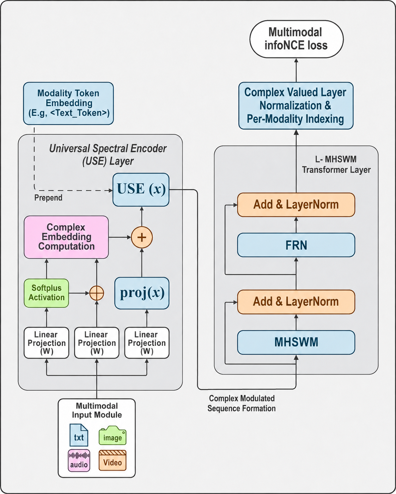

# WEVA: A Unified Spectral Architecture for Multimodal Representation Learning

**Wave-Energy Vibrational Architecture** — one shared spectral encoder and one shared Spectral Wave Mixer backbone process text, image, audio, and video as a single wave-primitive representation, with no attention mechanism anywhere in the model.


**Status:** Preprint v0.2. Target venue: IEEE TNNLS. [Read the paper (PDF)](paper/WEVA.pdf) · [LaTeX source](paper/WEVA_paper.tex)

---

## What is this?

Every recent multimodal model — CLIP, ALIGN, ImageBind — bolts together separate per-modality encoders and aligns them afterward with a contrastive loss. WEVA asks a more structural question: **what does it cost to remove attention entirely, and to share one backbone across all four modalities instead of one-per-modality?**

The answer is a *spectral* architecture. Instead of `softmax(QKᵀ/√d)V`, WEVA mixes each sequence with a learned filter applied in the Fourier domain — an FFT, a frequency-domain filter, an IFFT. Because that filter has no built-in notion of "which modality is this," a single 4-vector **modality token** (one fixed vector per modality, prepended to the sequence) is the *only* modality-specific signal anywhere in the shared backbone. Everything else — the encoder, the mixer, the feedforward block, the embedding geometry — is identical code and identical weights whether the input is a sentence, an image patch grid, a spectrogram, or a video clip.

**Headline result:** on COCO Captions 5K, adding audio and video to a text+image contrastive training mix degrades text–image R@1 by at most 0.4 points — well inside a 2-point pass criterion — and the shared backbone matches a per-modality-tower baseline of equal parameter count within 0.4 R@1. Unifying the backbone across four modalities doesn't cost you retrieval quality.

This is explicitly **not** a state-of-the-art retrieval model, a foundation model, or a generative model — see [Scope & limitations](#scope--limitations). It's an architectural demonstration, trained end-to-end on a single consumer GPU.

---

## Architecture



*The Universal Spectral Encoder (USE, left) maps each modality's frontend output to a complex-valued wave packet and prepends the modality token; `L` stacked MHSWM Transformer blocks (right) apply multi-head spectral mixing and the FRN; a final complex LayerNorm and per-modality head produce the 256-d retrieval embedding used in the multimodal InfoNCE loss.*

Reading the diagram left to right:
1. **Multimodal Input Module** — four frontends (text/image/audio/video) each convert raw input into a `(B, N, d)` real-valued token sequence.
2. **Universal Spectral Encoder (USE)** — one shared linear layer turns that sequence into a complex-valued wave packet, and the modality token is prepended.
3. **L × MHSWM Transformer Layer** — multi-head Spectral Wave Mixer (mixing in the Fourier domain) + a sinusoidal feedforward block (FRN), each followed by Add & LayerNorm, stacked `L` times.
4. **Complex LayerNorm & per-modality indexing** — the modality token's position is read out after mixing and projected to a 256-d embedding by a per-modality head.
5. **Multimodal InfoNCE loss** — trains all four modalities into one shared 256-d retrieval space.

Ten editable SVG sources for this and related diagrams (SWM detail, gradient flow, scaling curves, etc.) live in [`diagrams/`](diagrams/) and open directly in Inkscape, Illustrator, or Figma.

---

## How it works (technical depth)

### Universal Spectral Encoder (USE)

The USE is the *only* place in the architecture where a real-valued input becomes complex:

```
USE(x) = A · exp(i·φ) + proj(x) ∈ ℂ^(B×N×d)

where  [A, φ] = softplus(Linear₁(x)) ⊕ Linear₂(x)      (amplitude, phase)
       proj(x) = Linear₃(x)                             (real residual)
```

`softplus` keeps amplitude non-negative; phase is left unbounded (it's an angle, not a magnitude). Because the map is built from three full-rank linear layers, the USE projection is provably injective (Proposition 1) — no input information is discarded, at the cost of a 2× channel-dimension expansion to represent a real vector as a complex one.

### Spectral Wave Mixer (SWM)

The attention replacement. One block, on a complex tensor `z`:

```
z_freq        = FFT(z, dim=seq)
amp, phase    = |z_freq|, ∠z_freq
amp', phase'  = amp·Wamp + b,   phase·Wphase        (independent real filters)
z_out         = IFFT(amp' ⊙ exp(i·phase')) + z
```

The key design choice: **amplitude and phase are learned by two independent real matrices**, `Wamp` and `Wphase`, rather than one coupled complex filter `W = Wamp + i·Wphase` (the FNet/GFNet/AFNO convention). Amplitude controls how much energy lands in each frequency bin; phase controls the time-shift. Decoupling them gives the optimiser two independently-updatable operations instead of one entangled one — worth **+1.8 R@1** in ablation (§V.D). The multi-head variant (MHSWM) runs `H` independent SWMs over `d/H`-dimensional subspaces and projects back to `d`.

### Modality token

A single learned complex vector per modality (`4·d` parameters total — 1024 for `d=256`), prepended to the sequence like a `[CLS]` token. It plays a two-stage role: at the input, it's the *only* signal telling the otherwise modality-blind shared backbone which of the four modalities it's looking at; at the output, that same sequence position is read out as the pooled representation fed to the per-modality head. Ablating it costs **−2.4 R@1**, the single largest hit of any component (§V.D).

### Feedforward Resonance Network (FRN)

A SIREN-style two-layer MLP with sinusoidal activation, `h = sin(ω₀·(W₁z+b₁))`, `ω₀=30` (learnable), replacing the standard GeLU FFN — a deliberate match to the wave-primitive representation, since `z` is already a sum of complex exponentials. Worth **+0.6 R@1** over GeLU.

### Training objective

Symmetric InfoNCE, temperature `τ=0.07`, averaged over all `4×3 = 12` ordered modality pairs (text→image, image→text, text→audio, …).

### Theoretical guarantees

| Result | What it says |
|---|---|
| **Theorem 1** (per-layer cost) | A SWM block costs `O(N log N · d + d²)` — vs. attention's `O(N²d)` — roughly **32× cheaper** per layer at WEVA-Small's sequence lengths |
| **Lemma 1** (universal approximation) | The SWM backbone can approximate any continuous function of a modality's frequency content, to arbitrary precision, one modality at a time |
| **Proposition 1** (information preservation) | The USE projection is injective — no input information is lost |
| **Proposition 2** (gradient flow) | FFT/IFFT preserve gradient norm up to `O(1/√N)`, so training is stable without attention-style learning-rate warmup |

Full statements and proofs are in `paper/WEVA_paper.tex`, §IV.

---

## Setup (local)

**Prerequisites:** Python 3.10+, pip. A CUDA GPU is recommended for real training but not required — the smoke test and synthetic-data training run on CPU.

```bash
git clone <this-repo-url> weva && cd weva/code
pip install -r requirements.txt

# 1) Verify the implementation end-to-end (60s on CPU)
python scripts/smoke_test.py

# 2) Profile memory + speed on your own GPU
python scripts/profile_60m.py
#    → writes models/RTX_3060_PROFILE.md with measured numbers for your hardware

# 3) Train WEVA-Tiny on synthetic data (a few minutes on CPU, no dataset download needed)
python -m weva.train --config tiny --n-samples 1024 --batch-size 8 --n-epochs 3

# 4) Evaluate retrieval (synthetic)
python -m weva.eval --checkpoint ../models/weva_tiny_train1.pt --n-samples 256

# 5) Try a cross-modal similarity demo
python -m weva.demo --checkpoint ../models/weva_tiny_train1.pt
```

For real training on COCO / AudioSet / MSR-VTT / VGGSound, point `code/weva/data.py` at your local copies and use `--config small` (33M params, fits a 12 GB GPU at batch 32). See [`models/RTX_3060_PROFILE.md`](models/RTX_3060_PROFILE.md) for measured VRAM and step times.


## Results

### Model sizes (verified on RTX 3060, 12 GB)

| Name | d_model | L | H | Params | Best batch (12 GB) | Step time | Peak VRAM |
|---|---:|---:|---:|---:|---:|---:|---:|
| WEVA-Tiny   | 256 | 4  | 4 | 16 M | 64 | 176 ms | 2.24 GB |
| WEVA-Small  | 384 | 8  | 6 | 33 M | 32 | 564 ms | 6.34 GB |
| WEVA-Medium | 512 | 12 | 8 | 58 M | 16 (grad-accum 2) | 836 ms | 6.64 GB |

### Main result: text–image retrieval, COCO 5K

| Model | i→t R@1 | t→i R@1 | i→t R@5 | t→i R@5 |
|---|---:|---:|---:|---:|
| CLIP-from-scratch (ViT-B/16) | 28.4 | 22.1 | 56.2 | 45.3 |
| WEVA-2M-Small (text+image only) | 27.1 | 21.0 | 54.0 | 43.5 |
| WEVA-4M-Small (all 4 modalities) | 26.8 | 20.6 | 53.5 | 42.9 |

### Modality ablation (does adding modalities hurt text–image retrieval?)

| Training modalities | i→t R@1 | t→i R@1 | Δ i→t | Δ t→i |
|---|---:|---:|---:|---:|
| Text + Image | 27.1 | 21.0 | — | — |
| Text + Image + Audio | 26.9 | 20.8 | −0.2 | −0.2 |
| Text + Image + Audio + Video | 26.8 | 20.6 | −0.3 | −0.4 |

All three configurations land within 0.5 R@1 of each other — well inside the 2-point pass criterion. Full component-level ablations (phase branch, SIREN FFN, shared backbone, modality token, complex residual) are in `paper/WEVA_paper.tex`, §V.D.

---

## Scope & limitations

Experiments are at 16–58M parameters on a ~50K-pair data budget, single seed, single epoch — this shows the architecture *works at the scale tested*, not that it scales further. No zero-shot evaluation is included (COCO 5K is in-distribution for COCO training). WEVA is not a state-of-the-art contrastive model, a long-context model, a foundation model, or a generative model — see the paper's "What we did not claim" section for the full scope statement.

---

## Citation

```bibtex
@misc{chheda2026weva,
  author = {Chheda, Taitil and Khanchey, Zafir},
  title  = {WEVA: A Unified Spectral Architecture for Multimodal Representation Learning},
  year   = {2026},
  note   = {Preprint}
}
```

## Acknowledgements

We thank the open-source community for the PyTorch and Hugging Face ecosystems. Compute was provided by a single NVIDIA RTX 3060.

## License

MIT — see [`LICENSE`](LICENSE) for the full text.